# (PART\*) Introducción a R para Ciencias {.unnumbered}

# **Introducción a R básico**

Esta primera sección está enteramente dedicada al desarrollo, manejo y comprensión del lenguaje de programación R (en adelante: "R") en nivel básico. Se asume que el lector tiene instalados y configurados los programas R, RStudio y algún otro programa de soporte para el manejo de paquetes. Si no cuentas con ninguno en tu computadora, visita la sección [Prerequisitos](#prerequisitos) de este libro. 

Una ventaja de los lenguajes de programación es que nos permiten definir una secuencia de análisis adaptada específicamente a nuestro requerimiento analítico. El flujo de trabajo completo queda escrito en el código, y puede ser compartida con colegas cuando se necesite en trabajos colaborativos. Pero antes de aprender sobre los métodos analíticos, se necesita "hablar" bien el lenguaje R. 

Aprenderás a trabajar con el **código básico en R**, a **crear variables**, **funciones**, además de utilizar tidyverse para **manejo y limpieza de bases de datos**. Es esencial manejar estos conceptos antes de trabajar con estadística en R.

## Primer contacto con R

La forma simplificada de cómo funciona R incluye: dar una orden, presionar "enter" para que la computadora comience a procesar la orden, y luego recibir un resultado. Eso es básicamente lo que se hace con cualquier lenguaje de programación. 

R es considerada como una _calculadora con esteroides_ dado que puedes aplicar matemáticas con él; aquella ciencia sobre la que se cimentan las demás. Si puedes hacer ello, tienes las puertas abiertas a aplicar estadística, análisis de diferentes tipos, generar gráficos y todo lo que te imagines. Y pues sí, también hay cosas algo bizarras en R, como poder crear tu propio [calendario](https://r-coder.com/calendarios-r/) o usar [gatitos](https://github.com/R-CoderDotCom/ggcats) en tu gráfico de dispersión de puntos.

A diferencia de los lenguajes humanos (idiomas), un lenguaje de programación debe estar escrito a la perfección. No hay espacio para una coma mal puesta, un paréntesis olvidado, o un nombre mal colocado. La computadora solo ejecutará la orden si todo está escrito exactamente como debe ser. Todos los ejemplos de este libro pueden ser ejecutados correctamente si los escribes tal y como es mostrado. Previo a ello, se debe haber instalado y activado las librerías a usar (para más detalle, revisa la sección [Prerrequisitos](#prerrequisitos)).


## Paneles de RStudio 

Existen diversos editores de código que permiten trabajar con R, pero ninguno con la versatilidad de [RStudio](https://www.rstudio.com/). El programa está dividido en paneles que uno puede reorganizar a conveniencia. Más allá de la posición o el orden de los paneles, es necesario que se sepa reconocerlos por su contenido, las pestañas que contiene, entre otros. Aquí se presentan los paneles en su posición clásica, junto con algunas barras y botones que se deben conocer al iniciar con RStudio. 

(ref:paneles1) Panel de Trabajo. Aquí aparecerán los archivos de trabajo de R, sean R script o R Markdown. Además, es donde aparecen las bases de datos cuando se pide visualizarlas en RStudio.

```{r, echo=FALSE, fig.cap='(ref:paneles1)', fig.align='center', out.width="100%"}
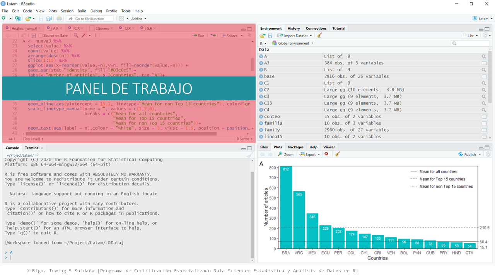
```
<br>

\newpage

(ref:paneles2) Consola. Es el panel donde se imprimen los resultados textuales y numéricos junto con el código que los genera.

```{r, echo=FALSE, fig.cap='(ref:paneles2)', fig.align='center', out.width="100%"}
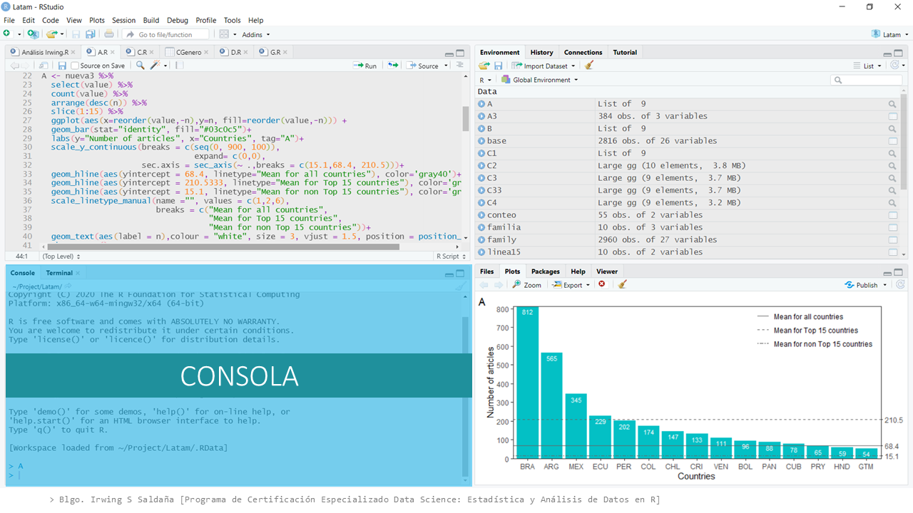
```
<br>

(ref:paneles3) Panel de Ambiente. Las pestañas de este panel se puede intercambiar o reposicionar a conveniencia con las del Panel Gráfico +. Aquí encontrarás: el ambiente (Environment) donde se guardan los objetos creados o cargados en RStudio; la historia (History) de las ejecuciones realizadas durante la sesión de RStudio; las conexiones (Connections) que se pueden realizar con bases de datos (Oracle, SQL, Salesforce, Spark, Hipe, entre otros); tutoriales (tutorial) precargados usando shiny para el uso básico de R y RStudio.

```{r, echo=FALSE, fig.cap='(ref:paneles3)', fig.align='center', out.width="100%"}
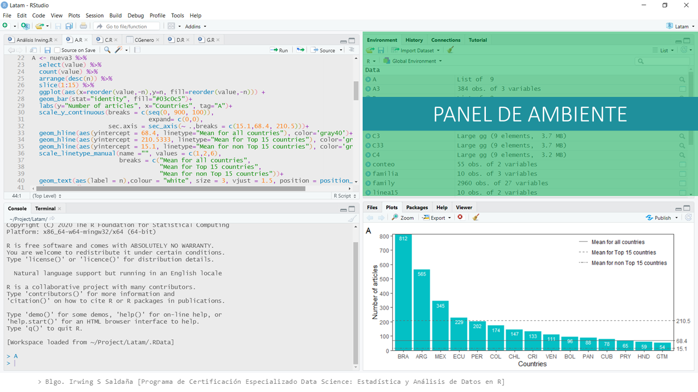
```
<br>

(ref:paneles4) Panel Gráfico +. Contiene las pestañas: archivos (Files) para visualizar los archivos de la carpeta de trabajo actual (definida como la carpeta "documentos" por defecto); la pestaña de visualización de gráficos estáticos (Plots); pestaña de  instalación y actualización de paquetes (Packages); la pestaña de ayuda (Help); y el visualizador (Viewer) de gráficos animados, gráficos 3D, objetos HTML.

```{r, echo=FALSE, fig.cap='(ref:paneles4)', fig.align='center', out.width="100%"}
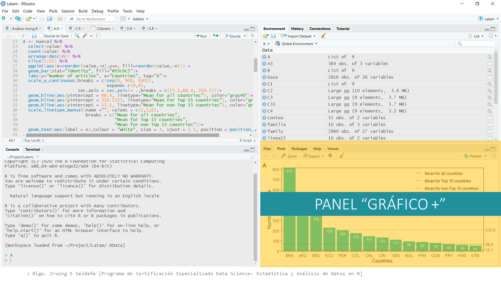
```
<br>

(ref:paneles6) Barra de opciones rápidas.

```{r, echo=FALSE, fig.cap='(ref:paneles6)', fig.align='center', out.width="100%"}
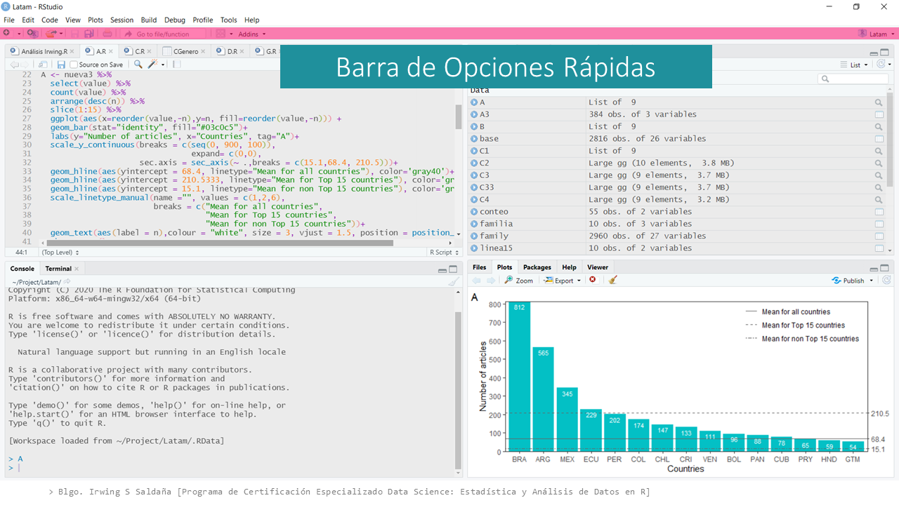
```

(ref:paneles5) Barra de menús. De las pestañas más importantes: File nos permite crear o cargar archivos; Session, definir espacio de trabajo actual; y Tools, ingresar a las configuraciones de RStudio. Usos más avanzados, como la depuración de código o el uso de versiones de control (Git), también se manejan desde las opciones de esta barra. 

```{r, echo=FALSE, fig.cap='(ref:paneles5)', fig.align='center', out.width="100%"}
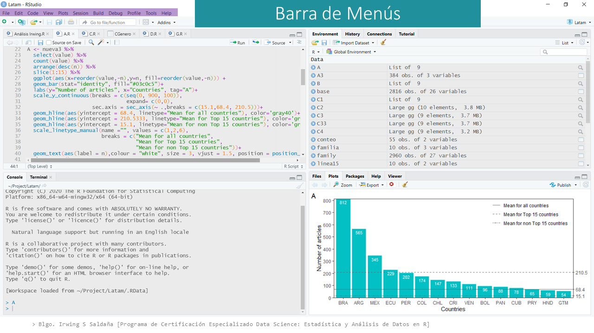
```
<br>

## Tipos de documentos en RStudio

Luego de conocer los paneles de RStudio, es necesario crear los espacios donde se escribirán las órdenes a modo de código. Estos documentos, como cualquier editor de texto, se pueden guardar o compartir, por ejemplo, mediante un correo electrónico.

### R Script (.R)
 
Es el documento más simple donde puedo escribir R. Es un editor de texto como el bloc de notas de cualquier sistema operativo. No obstante, este editor lee y colorea la sintaxis especial del código de R. Esto permite identificar cada parte del código según lo que sea: una variable, una función, un número, un texto, símbolos especiales, operadores, entre otros; simplificando enormemente la lectura del código y el aprendizaje de R.

```{block2, type='rmdnote'}
Puedes crear un R script haciendo clics ([FIGURA 1.7](fig:abrirRscript)), o utilizando el atajo de teclado `Control + shift + N` o `Command + shift + N`. 
```

(ref:rscript1) Procedimiento para abrir un documento de RScript usando el menú `File/ New File/ R script`.
 
```{r abrirRscript, echo=FALSE, fig.cap='(ref:rscript1)', fig.align='center', out.width="100%"}
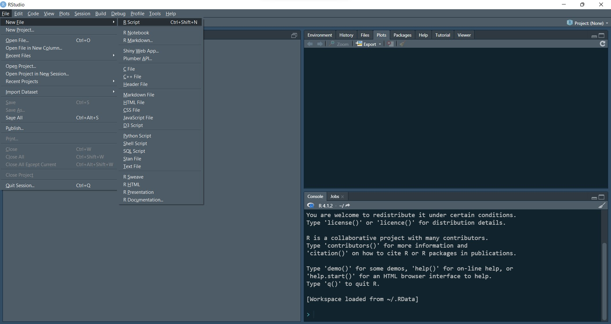
```

 
(ref:rscript2) Apariencia de un R script con código. Notar los colores diferenciales para cada parte del código.

```{r, echo=FALSE, fig.cap='(ref:rscript2)', fig.align='center', out.width="100%"}
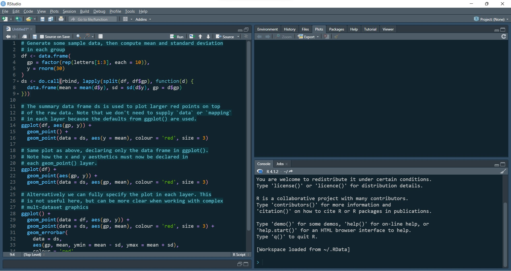
```


### R Markdown (.Rmd)

Es un formato de archivo para la creación de documentos dinámicos. Estos pueden ser: páginas web, aplicaciones shiny, diapositivas, o cualquier tipo de reporte que puede ser exportado en formato .docx, .pdf o .html. Utiliza la sintaxis de Markdown pero posibilitando la inclusión de "pedacitos de código", la traducción literal de code chunk. Los chunk se comportan como pequeños R scripts embebidos en el documento de texto plano escrito con sintaxis Markdown. 

Suena extremadamente complejo el decir "sintaxis Markdown", pero no lo es. Una vez uno sabe utilizar R, aprender Markdown resulta sencillo. Puedes aprender a utilizar R Markdown con el libro en línea [R Markdown: The Definitive Guide](https://bookdown.org/yihui/rmarkdown/) en su versión de 2018, o el más actualizado [R Markdown Cookbook](https://bookdown.org/yihui/rmarkdown-cookbook/) de 2020. Ambos libros han sido escritos en colaboración de Yihui Xie, uno de las mentes brillantes de RStudio y a quien le debemos el uso de documentos dinámicos en RStudio. 

No se profundizará en el uso de R Markdown, dado que no es el objetivo del programa, pero se utilizará frecuentemente durante las clases. Si eres un estudiante que no ha está llevando el programa, podrás siempre utilizar tanto R script como R Markdown para ejecutar tus códigos. Se recomienda fuertemente comenzar a utilizar este último dada la ventaja de permitir hacer anotaciones de texto plano como en cualquier editor de texto común. 

(ref:rmarkdown1) Procedimiento para abrir un documento de R Markdown usando el menú `File/ New File/ R Markdown...`.
 
```{r, echo=FALSE, fig.cap='(ref:rmarkdown1)', fig.align='center', out.width="100%"}
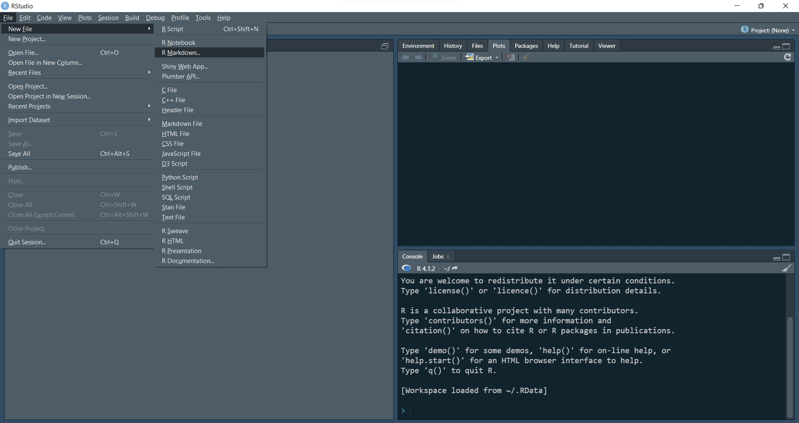
```

 
(ref:rmarkdown2) Ventana emergente para darle nombre al documento R Markdown.

```{r, echo=FALSE, fig.cap='(ref:rmarkdown2)', fig.align='center', out.width="100%"}
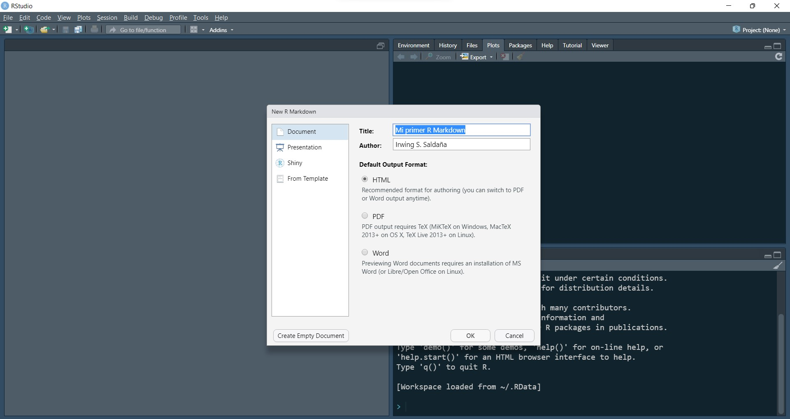
```


(ref:rmarkdown3) Aparecerá un archivo R Markdown con texto de ejemplo para que tengamos una idea de qué se puede hacer con él.
 
```{r, echo=FALSE, fig.cap='(ref:rmarkdown3)', fig.align='center', out.width="100%"}
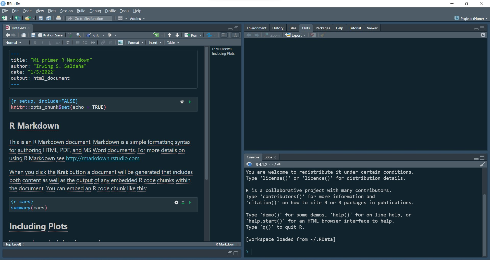
```

(ref:rmarkdown4) `knit` es una función del paquete `knitr`, desarrollado por Yihui Xie y colaboradores, para la generación de reportes dinámicos con R Markdown. Haciendo clic en el botón se despliega la lista de posibles exportaciones del documento. La exportación `Knit to HTML` produce una página web de reporte.

```{r, echo=FALSE, fig.cap='(ref:rmarkdown4)', fig.align='center', out.width="100%"}
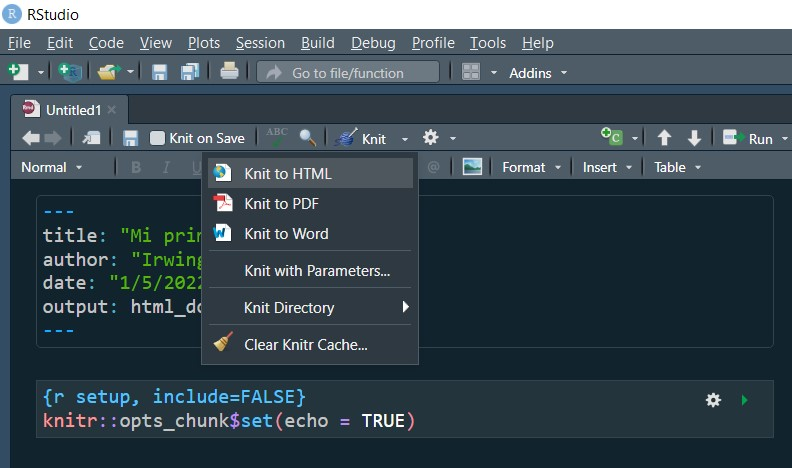
```


(ref:rmarkdown5) Tras hacer clic en `Knit to HTML`, será necesario guardar en el almacenamiento de la computadora el documento, cuya extensión es `.Rmd`.

```{r, echo=FALSE, fig.cap='(ref:rmarkdown5)', fig.align='center', out.width="100%"}
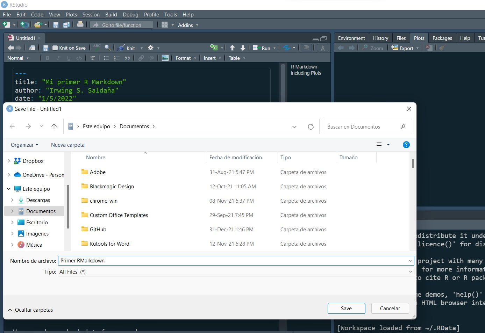
```

(ref:rmarkdown6) En la consola, o en una pestaña Render, comenzará a mostrarse la ejecución del código que `knit` desplegó para exportar el R Markdown a página web HTML.

```{r, echo=FALSE, fig.cap='(ref:rmarkdown6)', fig.align='center', out.width="100%"}
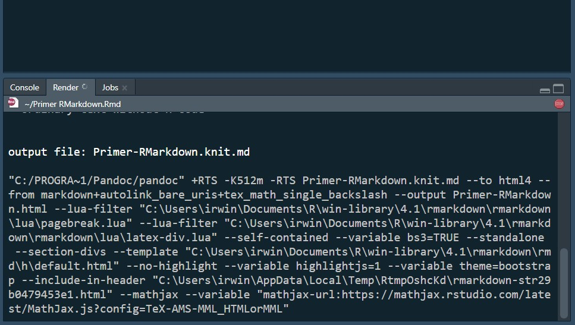
```

(ref:rmarkdown7) Vista del archivo HTML generado a partir del R Markdown de ejemplo.

```{r, echo=FALSE, fig.cap='(ref:rmarkdown7)', fig.align='center', out.width="100%"}
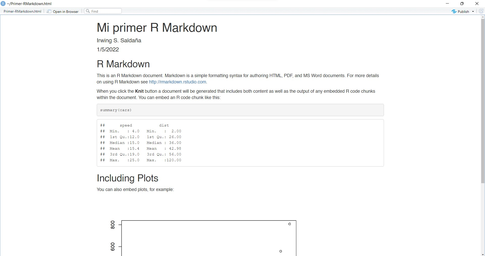
```

## Ejecutar código 

¿Alguna vez hiciste un histograma de frecuencias?. Hacer uno de manera exploratoria es muy sencillo en R. El siguiente código hará dos cosas en un solo paso: 

1. Creará un conjunto de 10,000 datos aleatorios que siguen en la distribución normal.
2. Generará el gráfico del histograma de frecuencias utilizando el conjunto previamente creado. 

Por ahora no se ahondará en el detalle de qué cosa es `rnorm()` o `hist()`.

```{r, out.width="100%"}
hist(rnorm(10000))
```

Para replicarlo, es necesario escribir el código exacto, para luego dar la orden, es decir, ejecutar el código. La ejecución se hace presionando en el teclado de tu computador `control + enter` o `command + enter` (usuarios macOS).

```{block2, type='rmdnote'}
Existen otros atajos de teclado para ejecuciones especiales.

- Ejecutar todas las líneas de código del script: `control (o command) + shift + enter`.
- Ejecutar desde el inicio del script hasta la línea actual: `control (o command) + Alt + B`.
- Ejecutar desde la línea actual hasta el final del script: `control (o command) + Alt + E`.

No obstante, no son necesarias. Es suficiente con conocer la ejecución básica, dado que para **ejecutar varias líneas de código a la vez** solo se deben seleccionar las requeridas y ejecutar con  `control + enter` o `command + enter`.
```

Una pregunta que siempre genera confusión es la presencia de unos corchetes `[1]` en los resultados vistos tanto en consola como en este libro. Esto no es parte de un resultado por si mismo, es la posición del elemento mostrado justo a la derecha del corchete. 

Si se ejecuta el símbolo `:` entre dos números, R generará el rango de valores enteros entre dichos números, incluyéndolos.

```{r}
1:100
```

El resultado muestra los confusos `[]` a la izquierda del primer elemento de cada fila del conjunto de datos resultante, indicando su posición dentro de la secuencia de elementos.

## Operaciones aritméticas 

Como ya se había mencionado antes, R nos permite operar con código. La cosa más sencilla para hacer en R es sumar. 

```{r}
10 + 10
```


```{block2, type='rstudio-tip'}
En adelante se visualizará tanto el código a ejecutar (primera línea del ejemplo de suma aquí propuesto) como su resultado textual, mismo que obtendrás en la consola de RStudio (segunda línea del ejemplo) si sigues los pasos de cada ejemplo o ejercicio.
```

<br>

```{r echo=FALSE, message=FALSE, warning=FALSE}
openxlsx::read.xlsx("figs/intro_files/tabla1.xlsx")%>% 
   kable(format = "pandoc", caption = 'Operaciones (símbolos) aritméticas en R')
```

## Funciones matemáticas 

Operaciones más complejas necesitan el uso de **funciones**. Estas son "secuencias de ordenes empaquetadas con un nombre pequeño y recordable" — la información sobre las funciones será desarrollada más adelante ([sección 2.2](#funciones)). En la siguiente tabla se presentan las funciones matemáticas más comunes en R: 

```{r, echo=FALSE}
openxlsx::read.xlsx("figs/intro_files/tabla2.xlsx")%>% 
  kable(format = "pandoc", caption = 'Operaciones matemáticas en R. Estos procedimientos matemáticos vienen predefinidos como ordenes denominadas "Funciones"')
```

## Comentar el código

Una forma de asegurar que en el futuro el código escrito sea entendible, incluso por nosotros mismos, es comentándolo. Dejar comentarios nos ayudará a recordar la intención con la que se escribió una sección determinada de los comandos.

Para comentar en R, se requiere colocar el símbolo `#` a la izquierda del texto a ser considerado comentario. 

```{r}
# Esta es una suma 
2 + 2 

10 * 2 # + 3029
```

Como queda en evidencia, no importa si el comentario está en solitario en una línea de código, o si está a la derecha de algo que sí se quiere ejecutar. Esto no afecta el resultado de la operación.
